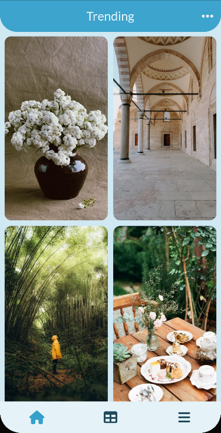
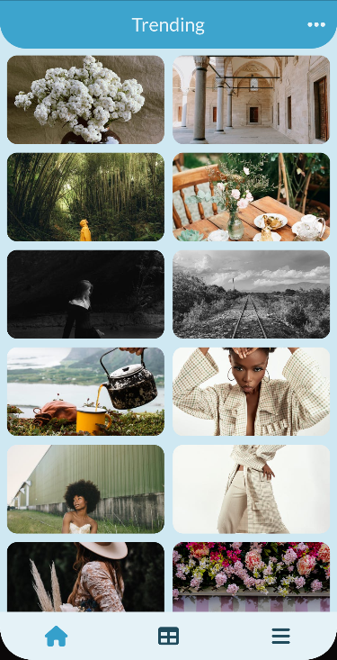
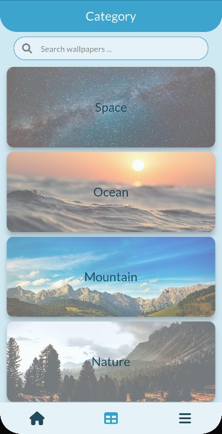
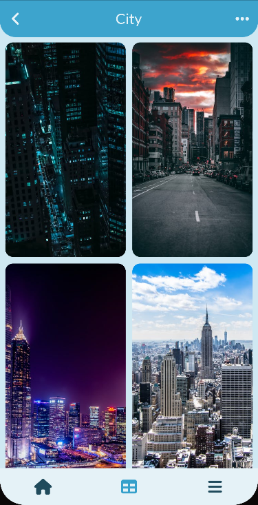
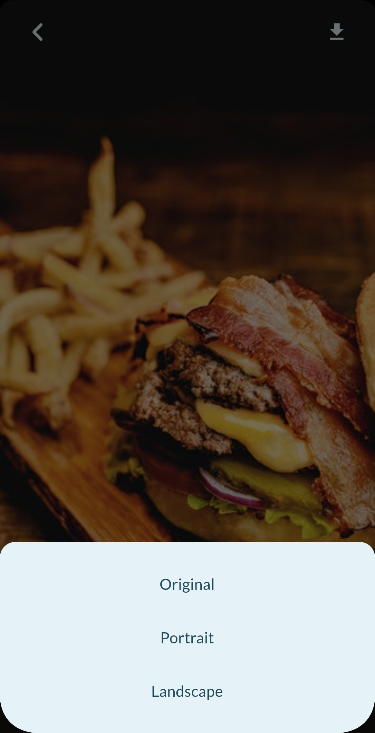
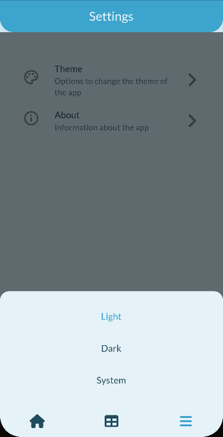

# Wallpaper

Practicing Flutter by building a simple wallpaper app with [Pexels API](https://www.pexels.com/api/).

## App preview

|  |  |  |
|:--------------------------------------------:|:---------------------------------------------:|:------------------------------------------:|
|           Trending Page (Portrait)           |           Trending Page (Landscape)           |               Category Page                |

|  |  |  |
|:---------------------------------------------:|:-------------------------------------:|:------------------------------------------:|
|              Search Result Page               |               Download                |               Settings Page                |

## Packages

The following packages are used.

| Package                        | Use for                                   |
| ------------------------------ | ----------------------------------------- |
| google_fonts                   | fonts                                     |
| font_awesome_flutter           | icons                                     |
| json_serializable              | generating code for serializable class    |
| freezed                        | generating code for immutable data class  |
| hooks_riverpod                 | state management and dependency injection |
| flutter_hooks                  | reducing boiler plate                     |
| fpdart                         | functional error handling                 |
| dio                            | http client                               |
| cached_network_image           | caching wallpapers                        |
| animated_bottom_navigation_bar | bottom navigation bar                     |
| another_flushbar               | notification                              |
| infinite_scroll_pagination     | wallpapers pagination                     |
| flex_color_scheme              | theming                                   |
| auto_route                     | navigation                                |
| retrofit                       | generating code for making api calls      |
| photo_view                     | zooming wallpapers                        |
| gallery_saver                  | saving wallpapers to gallery              |
| url_launcher                   | launching url                             |
| shared_preferences             | storing user preferences                  |
